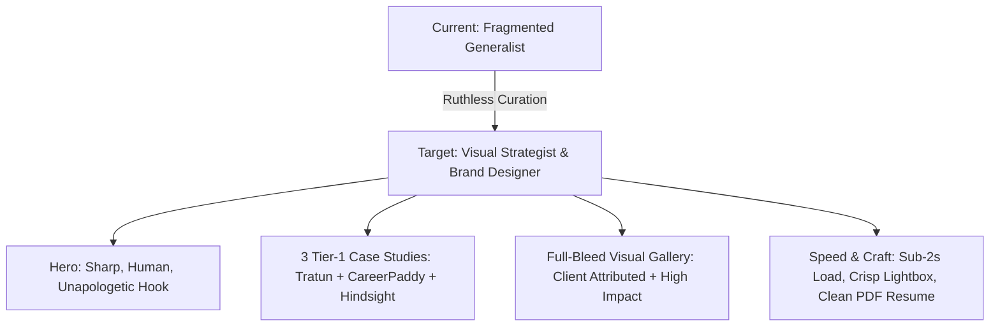

# Master Portfolio Critique, Global Benchmarks & Transformation Roadmap

> **Target Site:** [workwitholamide.vercel.app](https://workwitholamide.vercel.app)  
> **Designer:** Balogun Olamide (ENIGMA)  
> **Focus:** Graphic Design, Visual Brand Identity, UI/UX & Creative Operations  
> **Document Purpose:** Unified critique teardown, industry benchmarking (Dribbble / Pinterest / Awwwards), "10x Elevation Guide", and prioritized action roadmap.

---

## 1. Executive Verdict & Core Paradox

```
┌────────────────────────────────────────────────────────────────────────┐
│ THE PARADOX:                                                           │
│ You have real clients (Tratun, Grosvenor, CareerPaddy), real business  │
│ systems (1,397 courses, multi-brand ops), and real technical chops.    │
│                                                                        │
│ BUT your portfolio packages it as an all-in-one "everything builder"   │
│ with dense corporate/AI buzzwords, small artwork viewports, and        │
│ a broken mobile experience.                                            │
│                                                                        │
│ DIAGNOSIS: Not a talent problem. A ruthless curation problem.          │
└────────────────────────────────────────────────────────────────────────┘
```

### Scorecard Breakdown

| Metric | Score | Key Takeaway |
|:---|:---:|:---|
| **Raw Skill & Output** | `8.5/10` | Real client work, versatile range across brand, motion, print, and UI. |
| **Craft & Visual Presentation** | `6.5/10` | Designs are boxed into tiny slider viewports; text dominates over image. |
| **Positioning & Clarity** | `5.5/10` | "Creative Technologist" + "PWA dev" + "Public Admin" confuses recruiters. |
| **Case Study Storytelling** | `6.0/10` | Shows finished outputs, but lacks *process*, iterations, and sketches. |
| **Trust & Defensibility** | `6.0/10` | Performance claims (30% boost, 1,397 courses) sound inflated without context. |
| **Mobile & Technical Health** | `4.0/10` | Broken OpenGraph tags, slow 8-10s mobile load, failed lightbox expands, insecure PIN. |
| **True Career Potential** | `9.5/10` | Once curated, you easily rank in the top 10% of junior/mid hybrid designers. |

---

## 2. Global Benchmarks: How Top Designers Present on Dribbble, Pinterest & Awwwards

We analyzed leading portfolios across **Dribbble Pro**, **Pinterest Brand Boards**, **Awwwards (Site of the Day)**, and **ReadCV** to identify what creative directors and high-ticket clients respond to in 2025–2026:

### Benchmark A: The "70/30" Visual-to-Text Rule (Pinterest / Behance)
*   **What top designers do:** 70% of the viewport is high-fidelity imagery (billboards, real-world print, uncropped mobile screens, tactile textures). Text is 30%—concise, scannable, and punchy.
*   **Where your site stands:** Inverted (~60% text, 40% imagery). Viewers must read 3 paragraphs before seeing a single high-res asset.
*   **The Fix:** Lead with a full-bleed, high-impact hero mockup. Let the visual make them say *"Wow, that's clean"* before they read a single line.

### Benchmark B: The "At-a-Glance" Metadata Block (Awwwards / ReadCV)
*   **What top designers do:** Every case study opens with a standardized 4-item pill grid:
    ```
    ROLE:         Lead Visual Designer & Brand Strategist
    CLIENT:       Tratun Energy Limited (Downstream Oil & Gas)
    DELIVERABLES: 10 B2B Campaign Creatives, Social Framework, Guidelines
    IMPACT:       100% first-pass executive sign-off, live across LinkedIn
    ```
*   **Where your site stands:** Mixes design, development, and data architecture terms in rambling paragraphs, making it ambiguous whether you designed it, coded it, or just managed the team.

### Benchmark C: The "Process & Iteration" Journey (Dribbble / Bestfolios)
*   **What top designers do:** They show the messy, smart middle.
    1.  *The Constraint / Brief*
    2.  *Early Sketches & Rough Concepts* (showing ideas that failed)
    3.  *The Core Breakthrough / Metaphor* (e.g., Highway curve = Smile)
    4.  *The Design System in the Wild* (applied across billboards, trucks, Instagram, decks)
*   **Where your site stands:** Jumps immediately from brief to final polished graphic. You prove *execution*, but not *design thinking*.

---

## 3. What Would Make It World-Class ("10x Better")

Here is how you transform this from an ambitious student portfolio into a **commanding, high-authority creative portfolio**:



### 1. Rebrand the Headline & Value Proposition
*   ❌ **Current:** *"Digital Design for Development Outcomes. I engineer visual systems and digital tools with a rigorous Public Administration lens."*
*   ✨ **10x Version:**  
    > **"I design high-conversion brand campaigns, visual systems, and digital interfaces that help businesses scale."**  
    > *Subtitle:* "Digital Designer & Visual Strategist based in Lagos. Merging commercial design discipline with operational clarity."

### 2. Turn CareerPaddy into your Flagship "Design Operations" Case Study
CareerPaddy is your golden ticket. Designers who can create **modular design systems that non-designers can use** are rare and highly prized.
*   **Name of Case Study:** *“Scaling Visual Production: A 1,397-Course Modular Design System for CareerPaddy”*
*   **Visual Highlights:**
    *   Show the typographic hierarchy & color-tier framework (Beginner = Emerald, Intermediate = Gold, Advanced = Cyan).
    *   Show the spreadsheet data mapping alongside the generated video title cards.
    *   Frame the metric: *"Engineered a modular template library that enabled the marketing team to roll out 46 video launches with 30% faster turnaround time."*

### 3. Make Tratun Energy a Masterclass in Visual Metaphors
*   **Visual Highlights:**
    *   Present the **"Highway Smile"** concept at full 1400px width.
    *   Add a breakdown: *The Brief* (Humanize industrial B2B fuel logistics) → *The Concept* (Highway curvature as emotional resonance) → *The Asset* (Zero-revision LinkedIn rollout).

### 4. Separate "Design" from "Code" with Defensible Integrity
Do not list yourself as a full-stack engineer unless applying for software engineering roles. Instead, frame your coding ability as an **unfair advantage as a designer**:
> *"Designer who codes. I build functional prototypes and lightweight web tools (HTML/JS, Supabase) to validate ideas before handing off to production."*

### 5. Replace the Dark Obsidian Tech Shell with an "Editorial Studio" Aesthetic
*   **Inspiration:** Kinfolk, Monocle, Pentagram, Studio Freight.
*   **Palette:** Deep rich off-black (`#111113`), crisp gallery white / warm bone (`#F8F7F4`), vibrant signature gold (`#E5A93C`).
*   **Typography:** Clash Display (bold, geometric, confident) paired with Switzer or Inter (clean, neutral, maximum legibility). No monospace code fonts in body copy.

---

## 4. Section-by-Section Teardown & Fix Matrix

```
┌──────────────────────────────────────────────────────────────────────────────────┐
│ SECTION TEARDOWN                                                                 │
└──────────────────────────────────────────────────────────────────────────────────┘
```

### 1. Navigation & Header
*   **Issues:** Too many links (7 items), takes up too much vertical height on mobile.
*   **Fix:** Trim to: `Work` • `About` • `Experience` • `Contact` + `[Let's Talk]` CTA button.

### 2. Hero Section
*   **Issues:** Status pill with pulsing dot is a generic template cliché; stats are confusing.
*   **Fix:**
    *   Remove status pill completely.
    *   Replace stats row with 3 defensible proofs:
        1.  **3+ Years** • *Commercial Visual & Brand Design*
        2.  **46+ Campaigns** • *B2B & Social Ad Creatives Delivered*
        3.  **1,397 Assets** • *Orchestrated via Modular Templates*

### 3. Case Studies (Tratun & Grosvenor)
*   **Issues:** 10-item thumbnail filmstrip with interactive slider is slow, breaks on mobile Safari, and shrinks the artwork into a tiny box.
*   **Fix:**
    *   Replace sliders with a **vertical storytelling scroll** or a **large carousel** where the image takes 80% width.
    *   Include high-resolution zoom on single click.

### 4. Graphic Design & Performance Adverts Gallery
*   **Issues:** Generic titles (*"Commercial Service Campaign"*), no client names, no platform tags.
*   **Fix:** Add client badges and real platform destinations:
    *   *“Tratun Energy • LinkedIn Thought Leadership”*
    *   *“CareerPaddy • Google Demand Gen Story Ad (Lagos/Abuja)”*
    *   *“AYAC 2026 • Pan-African Conference Key Visual”*

### 5. UI/UX (Ektos & Hindsight)
*   **Issues:** Embedded inside the massive single page; 5-step phone simulator is sluggish on low-memory phones.
*   **Fix:**
    *   Show a stunning 3D isometric composite of the 5 screens together as the main hero visual.
    *   Provide a "View Interactive Prototype" external Figma or video sandbox link.

### 6. Video & Motion Reels
*   **Issues:** 4 video files embedded in HTML bloat page weight to >40MB on first load.
*   **Fix:**
    *   Use poster thumbnails with `play-on-click` lazy loading. Never preload full `.mp4` files into the initial DOM.

### 7. Resume & Admin PIN System
*   **Issues:** Client-side PIN lock is insecure and unnecessary; resume modal duplicates experience timeline.
*   **Fix:**
    *   Delete admin PIN modal and in-browser editor toolbar from production build.
    *   Replace resume modal with a clean `[Download Resume PDF]` button pointing to a formatted, 1-page PDF.

---

## 5. Master Prioritized Action Roadmap

```
┌──────────────────────────────────────────────────────────────────────────────────┐
│ EXECUTION PHASES                                                                 │
└──────────────────────────────────────────────────────────────────────────────────┘
```

### Phase 1: Critical Triage (Do Today — P0)

- [ ] **Fix OpenGraph Meta Tags:** Set absolute URLs for LinkedIn image preview:
  ```html
  <meta property="og:image" content="https://workwitholamide.vercel.app/assets/images/enigma-logo-hd.png">
  <meta name="twitter:image" content="https://workwitholamide.vercel.app/assets/images/enigma-logo-hd.png">
  ```
- [ ] **Remove Insecure Admin PIN System:** Delete `#adminPinModal`, `#editorToolbar`, and `#imageSwapModal` from `index.html` and `app.js`.
- [ ] **Fix Broken Lightbox & Mobile Tap Targets:** Ensure clicking any image opens a lightweight, hardware-accelerated full-screen modal with pinch-to-zoom on iOS/Android.
- [ ] **Convert Images to WebP:** Run all gallery and case study assets through WebP conversion (average 75% file size drop).

---

### Phase 2: Positioning & Copy Modernization (P1)

- [ ] **Rewrite Hero Copy:** Center your identity as a *Visual Designer & Brand Strategist*.
- [ ] **Reframe Stats:** Replace vague metrics with defensible design outcomes.
- [ ] **Add Metadata Blocks to Case Studies:** Add standardized `ROLE`, `CLIENT`, `CONTRIBUTION`, `OUTCOME` tags.
- [ ] **Attribute All 15 Gallery Pieces:** Replace placeholder descriptions with real client names and campaign contexts.
- [ ] **Remove AI/Corporate Buzzwords:** Eliminate terms like *“predictive cognitive interfaces”*, *“development outcomes”*, and *“frictionless task logging”*.

---

### Phase 3: Visual & Architectural Upgrades (P2)

- [ ] **Enlarge Artwork Viewports:** Make project images 1.5x–2x larger on desktop; remove nested cards and over-engineered slider filmstrips.
- [ ] **Split into Multi-Page / Deep-Dive Routes:**
  *   `index.html` (Curated Showcase & Hero)
  *   `case-study/careerpaddy.html` (Deep dive into modular video system)
  *   `case-study/tratun.html` (Full 10-campaign brand suite)
  *   `case-study/hindsight.html` (Product UX & AI prototype)
- [ ] **Video Lazy-Loading:** Replace video tags with static webp covers + dynamic modal playback.
- [ ] **Single Unified Resume CTA:** Direct link to `/assets/Balogun_Olamide_Resume.pdf`.

---

### Phase 4: World-Class Polish (P3)

- [ ] **Add Client Testimonials / Endorsements:** Include 1–2 quotes from Tratun, CareerPaddy, or academic leadership.
- [ ] **Add Behance & Dribbble Links:** Connect footer icons to active design profiles.
- [ ] **Skeleton / Blur-Up Loaders:** Add subtle CSS shimmer placeholders so images never flash blank while loading on slow networks.
- [ ] **Editorial Micro-Interactions:** Smooth page transitions, clean cursor hover states on interactive images, and refined scroll rhythm.

---

## 6. Summary: The One Sentence to Remember

> **"Stop telling people how smart the code is—show them how undeniable the design is."**

When your visuals are large, your client stories are honest, your role is explicit, and the mobile page loads in under 2 seconds, this portfolio will consistently win interviews and high-value freelance clients.
